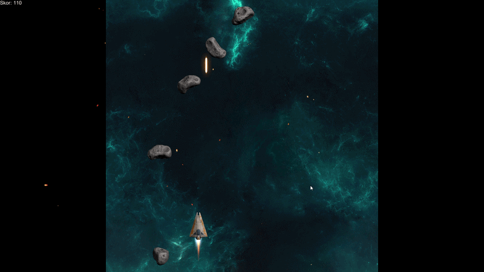

🚀 Space Shooter - 2D Arcade Game

Space Shooter, üniversite eğitimimin 2. sınıf 1. döneminde geliştirdiğim, Unity motoru ve C# dili üzerine temellendirilmiş dinamik bir arcade oyun projesidir. Bu projede temel amacım, oyun mekaniklerini matematiksel sınırlandırmalar ve fizik motoruyla optimize ederek akıcı bir kullanıcı deneyimi sunmaktı.

🛠️ Teknik Özellikler ve Kazanımlar
Bu proje sürecinde aşağıdaki teknik yapıları uygulayarak oyun geliştirme yetkinliklerimi pekiştirdim:

Boundary Management (Sınır Yönetimi): Oyuncunun oyun alanı dışına çıkmasını engellemek için Mathf.Clamp fonksiyonu ile matematiksel kısıtlamalar uygulandı.

Dynamic Fire Rate Control: Atış mekaniğini dengelemek amacıyla Time.time bazlı bir "soğuma süresi" (cooldown) algoritması geliştirildi.

Game Feel & Physics: Geminin hareket yönüne göre hafifçe yatmasını sağlamak için Quaternion.Euler ile rotasyon ve fizik tabanlı hareket optimizasyonları yapıldı.

Collision & VFX: Asteroit ve mermi etkileşimleri için OnTriggerEnter mekanizması kullanıldı ve patlama efektleri (Particle System) entegre edildi.

💻 Kullanılan Teknolojiler
Engine: Unity

Language: C#

Tools: Visual Studio, GitHub Desktop

👤 Hakkımda
Ben kerem, bir yazılım mühendisliği 2. sınıf öğrencisi ve üniversite topluluğumda Oyun Geliştirme Koordinatörü olarak görev yapmaktayım. C#, Unity ve web teknolojileri üzerine projeler geliştirerek teknik portfolyomu genişletmeye devam ediyorum.
